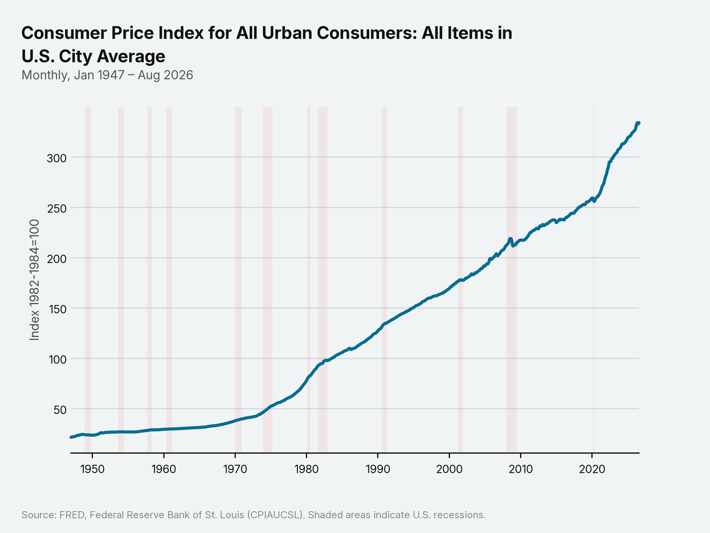
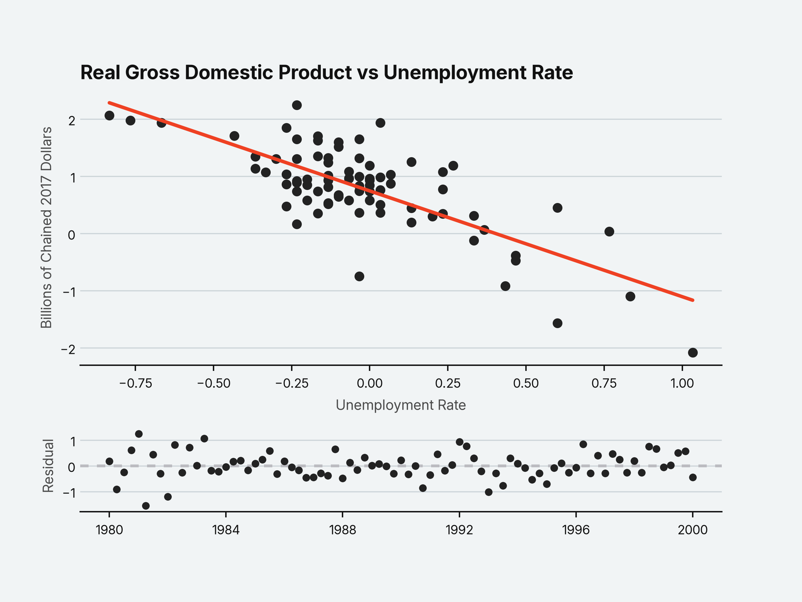

# econterm

econterm is a command-line tool for economic analysis and visualization.

It fetches data from the St. Louis Federal Reserve (FRED) API, stores it locally, runs ordinary least squares (OLS) regressions, and saves charts.

## Example

### Series Plotting

```bash
econterm fetch CPIAUCSL USREC
econterm plot CPIAUCSL
```



### Linear Regression

```bash
econterm fetch UNRATE GDPC1
econterm regress GDPC1 UNRATE --y-transform log_diff_pct --x-transform diff --start 1980-01-01 --end 2000-01-01

GDPC1: Real Gross Domestic Product (fetched 2026-09-25 18:14 UTC)
UNRATE: Unemployment Rate (fetched 2026-09-25 18:14 UTC)
```
```text
                  coef          se           t           p
----------------------------------------------------------
const           0.7459      0.0569      13.106       0.000
UNRATE         -1.8494      0.1823     -10.143       0.000
----------------------------------------------------------
n                               81
R²                          0.5657
Adj. R²                     0.5602
Condition number               3.2
```



   ## Installation
   Requires Python 3.12+ and a free [FRED API key](https://fred.stlouisfed.org/docs/api/api_key.html).

```
   git clone https://github.com/<you>/econterm.git
   cd econterm
   pip install -e .
   cp .env.example .env
```
   Then replace `your_key_here` in `.env` with your key. The first command you run may take a few seconds while matplotlib builds its font cache.

## Usage

### fetch
Download one or more series from FRED and store them locally. Include `USREC` for recession shading.
```
econterm fetch GDPC1 UNRATE USREC
```

### plot
Plot a stored series. Saves to `charts/series/<series_id>.png`.
```
econterm plot UNRATE --start 2000-01-01
```

### regress
Regress one series on another, print the results, and save a chart to `charts/regressions/<y>_<x>.png`.
```
econterm regress GDPC1 UNRATE --y-transform log_diff_pct --x-transform diff --start 1980-01-01 --end 2010-12-31
```
Transforms: `level` (default), `diff`, `pct_change`, `log_diff`, `log_diff_pct`.

### list
Show stored series and when each was fetched.
```
econterm list
```

`--start` and `--end` take `YYYY-MM-DD` dates. Run any command with `--help` for all options. The database lives in `~/.econterm/`. 

`et` works as a short name for `econterm`.

## How it works

econterm is split into five modules, each depending only on the ones before it:

- `api.py` fetches series metadata and observations from the FRED API, concurrently, with retries on rate limits and timeouts.
- `storage.py` saves everything to a local SQLite database (`~/.econterm/econterm.db`).
- `analysis.py` converts frequencies, applies transforms, aligns dates, and runs OLS.
- `viz.py` draws the charts and returns them without saving.
- `cli.py` connects the others and handles all input and output.

Notable choices:

- **OLS is implemented from scratch** with NumPy (normal equations), with results checked against `statsmodels` to six decimal places.
- **`fetch` is the only command that uses the network.** `plot` and `regress` read from the local database, so they work offline.

## Limitations

- One regressor per regression.
- Monthly and quarterly series only.
- Standard errors assume independent errors (no HAC), so p-values are optimistic for most macro data.
- Regressing two trending series in levels often shows a strong relationship that isn't real. For most macro series, use a difference or growth-rate transform.
- Outliers aren't handled. A few extreme observations can move the fitted line a lot.
- Stored data doesn't update until you `fetch` again. FRED occasionally revises historical data, which won't be reflected in your local database until you fetch again.
- `--end 2010` means 2010-01-01. Use a full date (`--end 2010-12-31`) to include the whole year.

## Development

```
pip install -e ".[dev]"
pytest
```

The tests check the OLS implementation against statsmodels to six decimal places.

## License
MIT.